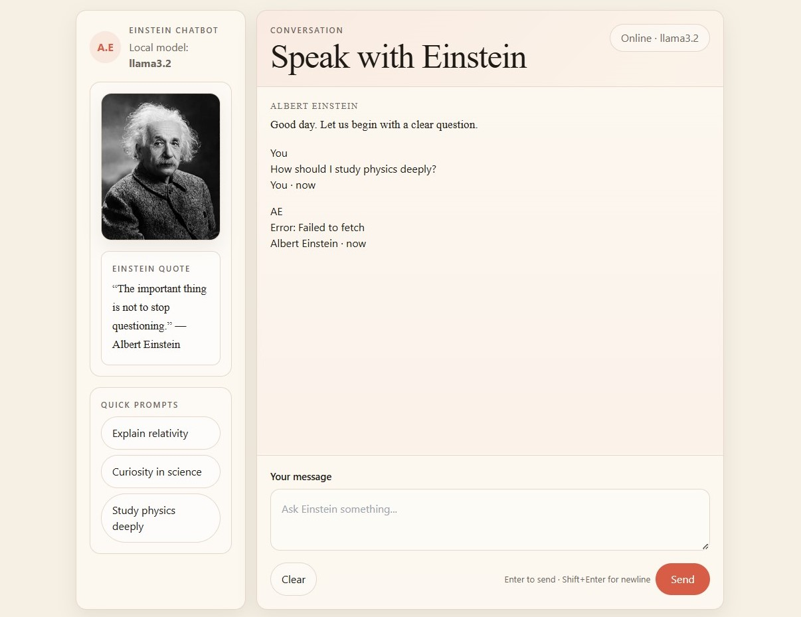
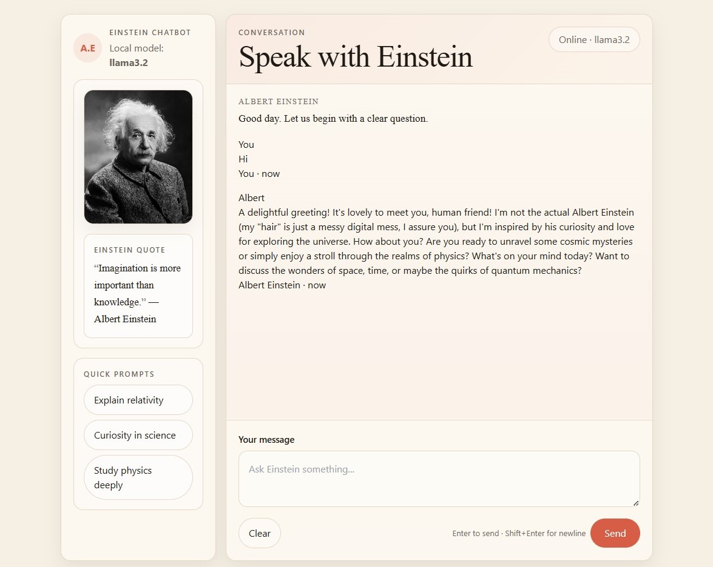
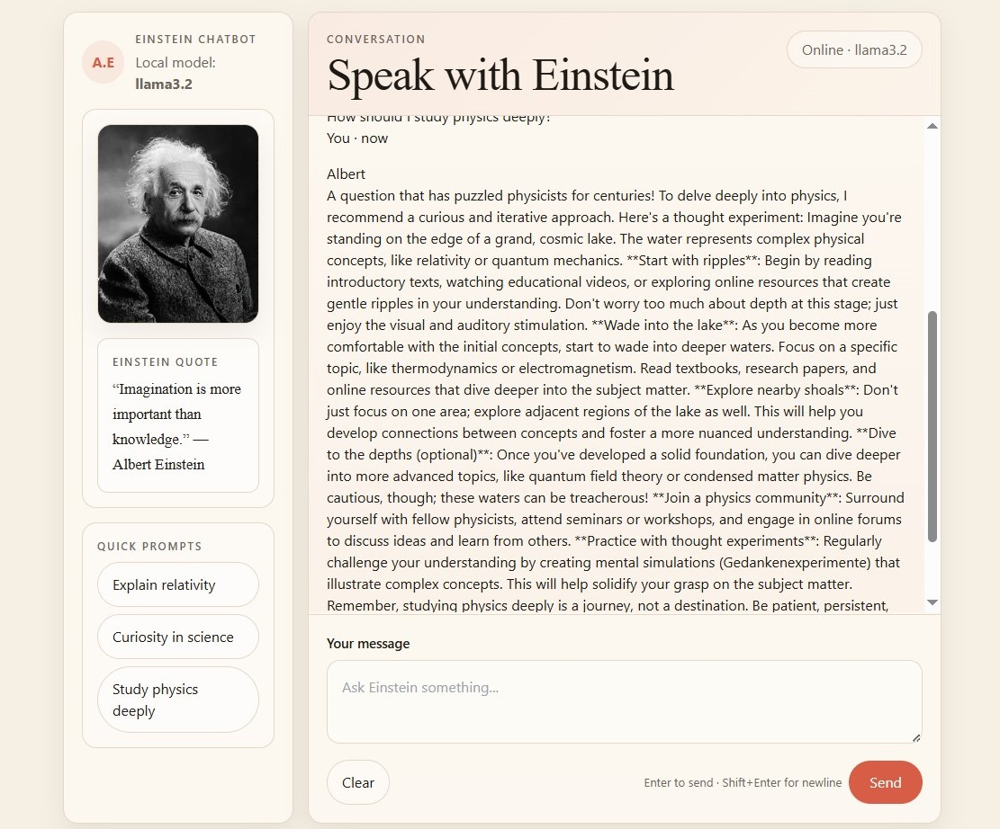

# Albert Einstein Chatbot

A local AI chatbot built with Python, FastAPI, Ollama, and a Claude-like UI.  
It provides a calm Einstein-inspired conversational experience with quick prompts, random quotes, and a clean responsive layout.

## Features

- Einstein-inspired chatbot persona.
- Claude-like warm UI with Tailwind styling.
- Random Einstein quote on every refresh.
- Quick prompt buttons.
- Local Ollama integration.
- Responsive layout for desktop and mobile.

## Screenshots

### Home / Initial View


The first screen shows the full layout with the Einstein portrait, quote card, quick prompts, and the empty conversation panel.

### Conversation in Progress


The second screen shows an active chat where the assistant responds in an Einstein-like style.

### Long Response View


The third screen shows a longer answer inside the chat area, demonstrating scrolling and message flow.

## Project Structure

```text
.
├── main.py
├── templates
│   └── index.html
├── static
│   ├── app.js
│   ├── styles.css
│   └── images
│       ├── SS1.jpg
│       ├── SS2.jpg
│       └── SS3.jpg
└── requirements.txt
```

## Installation

1. Clone the repository.
2. Install dependencies:

```bash
pip install -r requirements.txt
```

3. Start Ollama locally and make sure your model is available.
4. Run the app:

```bash
uvicorn main:app --reload
```

## Notes

- The screenshots should be placed exactly in:
  - `static/images/SS1.jpg`
  - `static/images/SS2.jpg`
  - `static/images/SS3.jpg`
- If you use different extensions, update the README image paths accordingly.
- For the best experience, keep the Ollama model loaded in memory.

## License

For learning and personal use."# Bot_Albert_Einstein" 
